The aim of this guide is to help the reader to understand how the system and components of Fitbot is
designed, implemented and tested. In the same time, this developer guide also serves to help developers who are interested in understanding the architecture
of Fitbot and some design considerations.
[Don't know about Fitbot? Click here to find more.](https://ay2122s1-cs2113t-f14-2.github.io/tp/)

## Content page
[Acknowledgements](#acknowledgements)

[Design](#design)
- [Architecture](#architecture)
- [Data Component](#data-component)
  - [Data Component (Profile)](#data-component-profile)
  - [Data Component (ItemBank and Item)](#data-component-item)
    - [ItemBank Class Hierarchy](#itembank-class-hierarchy)
    - [Item Class Hierarchy](#item-class-hierarchy)
- [Ui Component](#ui-component)
- [Logic Component](#logic-component)
- [Storage Component](#storage-component)
- [State Component](#state-component)
- [Implementation](#implementation)
   - [Parsing of Commands](#parsing-of-commands)
   - [Add Food Item Feature](#add-a-food-item-feature)
   - [Add a Recurring Exercise Feature](#add-a-recurring-exercise-feature)
   - [Loading Of Data On Startup](#loading-of-data-on-startup)
   - [Create Profile If Not Exist On Startup](#create-profile-if-not-exist-on-startup)
- [Product Scope](#product-scope)
   - [Target User Profile](#target-user-profile)
   - [Value Proposition](#value-proposition)
- [User Stories](#user-stories)
- [Non-functional Requirements](#non-functional-requirements)
- [Glossary](#glossary)
- [Instruction for Manual Testing](#instructions-for-manual-testing)
  - [Launch](#launch)
  - [Setting Up Profile](#setting-up-profile)
  - [Customising Profile](#customising-profile)
  - [Recording Food Items](#recording-food-items)
  - [Recording Exercise Items](#recording-exercise-items)
  - [Scheduling Exercises](#scheduling-exercises)
  - [Building Food Bank](#building-food-bank)
  - [Building Exercise Bank](#building-exercise-bank)
  - [Exiting Program](#exiting-program)
  - [Manipulating And Saving Data](#manipulating-and-saving-data)

## **Acknowledgements**

Firstly, we would like to acknowledge [AddressBook Level-2](https://github.com/se-edu/addressbook-level2/blob/master/test/java/seedu/addressbook/parser/ParserTest.java) as we adapted its utility methods for
testing in one of our classes, `ParserManager`. \
We would also like to acknowledge [AddressBook Level-3](https://se-education.org/addressbook-level3/) for providing many useful insights on how to write and structure our code in 
Object-Oriented Programming fashion. 

## **Design** 

### **Architecture**

  <image width="90%" src="images/Architecture.png" alt="Architecture Diagram"/>

`Main` class is the component that interacts with all the necessary classes.
The `Main` class consists of the few components as shown below:
- `Ui`: Facilitates interaction between user and application
- `Logic`: Parses commands and execute them respectively
- `Data`: Allows users to perform Create, Read, Update, Delete (CRUD) operations on the data in the application
- `Storage`: Stores all data in the application. Saves a copy of data in relevant files.
  Data will be retrieved from storage upon starting of application.
- `State`: Helps the user to restore or create profile data. 

Upon launching of application:
- The application will check if there are files that are already stored in the respective folder.
  If there is such files, the contents of the files will be loaded to the data section of the application.
  Instances of profile, data(e.g. FoodList, ExerciseList, FutureExerciseList, ItemBank) and storage will be created.
- If there is no such files, the files will be created.

Upon exiting of application:
- The application will save all data into the files created. All instance of components will be cleared automatically.

Class diagram of Main

  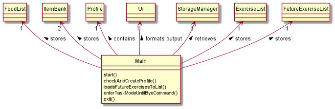

When _Fitbot_ is being started, the above instances (`Ui`,`State`, `LogicManager`,`DataManager` and `StorageManager`)
are being created in the main class. The main class will require 1 of each instance for the application to function.

- Main class start of by running the `start()` function which loads all information using StorageManager class to the 
Profile, FoodList, ExerciseList,ItemBank(foodBank, exerciseBank).
-Next main class will check if user contains the profile using the `checkAndCreateProfile()`. If user does not have
a profile, the application will assist user to create a profile by prompting questions.
-After setting up/ ensuring that user have a profile, the main program will enter `enterTaskModeUntlByeCommand()` 
for user to interact with the application
- Once user has keyed in the command `bye`, the main program will exit out of the `enterTaskModeUntlByeCommand()`
and run the `exit()` command to exit the application.

  

### **Data Component**

  

The `Data` component is responsible to perform operations such as data modification and query in the code.

In `Data` component, it consists of:
1. `DataManager` class which is responsible to help interaction between classes in `Logic` Component and classes in `Data` Component.
2. `Profile` package which is responsible to any manipulation and modification of data for `Profile`.
3. `Item` package which is responsible to any manipulation and modification of data for `Item` such as `Food` and `Exercise`.
4. `Verifiable` interface which is responsible to check data validity in storage files.

#### **Data Component (Profile)**

  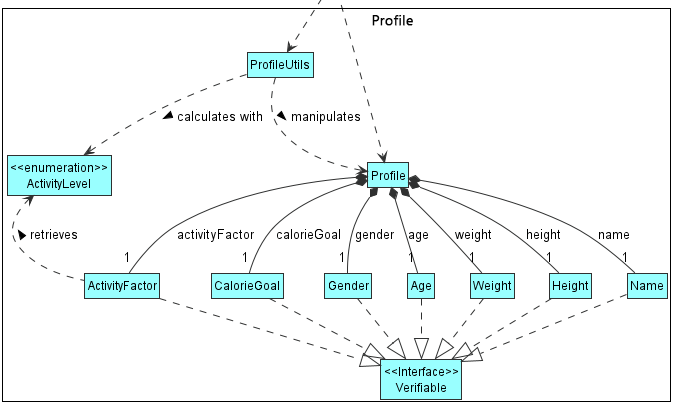

A `Profile` class has various attributes such as `Name`, `Height`, `Weight`, `Gender`, `Age`, `CalorieGoal` and `ActivityFactor`

- Using these attributes it is able to calculate an estimated Basal Metabolic Rate (BMR) using the Harris-Benedict Equation based on your activity levels. Therefore, while calculating your net calories for the day, your BMR is factored in to give you an estimated calculation of your net calorie.

- All the attributes implement a `Verifiable` interface to enable us to check if the attributes are valid. This is important for the setting up of profile or the loading of profile from storage to ensure data integrity of the user's attributes.

The `ProfileUtils` class is used in performing calculations (such as BMR or BMI) with the various attributes of the `Profile` class.

#### **Data Component (Item)**

  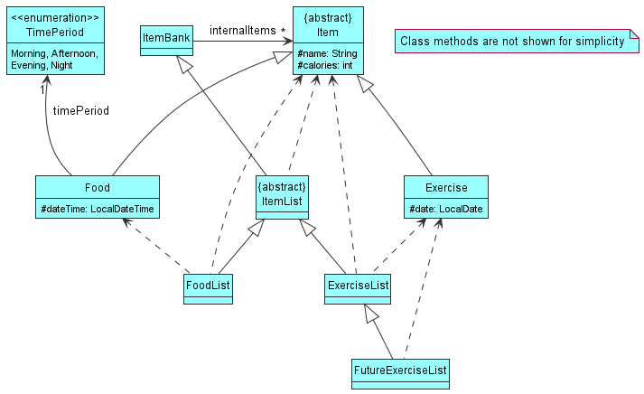

Above is a high-level class diagram for all the classes in `Item` package. In `Item` package, it has 
two different class hierarchy, one is `ItemBank`, and one is `Item`.

The main purpose of having `ItemBank` and `Item` classes is to allow user to perform writing, reading, editing and deleting operations in the program.

#### ItemBank Class Hierarchy
1. `ItemBank` is the *highest superclass* that contains one attribute called `internalItems` which is an _array list_ of `Item`.
2. `ItemList` being the *subclass* of `ItemBank` and *superclass* of `FoodList` and `ExerciseList`, which inherits all the methods available from `ItemBank`, with additional methods that form a dependency on `Item` class.
3. `FoodList` and `ExerciseList` are *subclasses*  that inherit all the methods available from `ItemList`, while each of them also contains more methods that form a dependency
on `Food` class and `Exercise` class respectively.
4. `FutureExerciseList` is a *subclass*  that inherits all the methods available from `ExerciseList` and contains other methods that form a dependency
on `Exercise` class.

As shown in the diagram above, `DataManager` class has association with `ItemBank`. This also implies that it has association with
all the subclasses that inherits `ItemBank`. 

#### Item Class Hierarchy
1. An `Item` class contains two attributes, `name` which represents the name of the item, and `calories` which represents the calorie intake/burnt from the item.
2. `Food` and `Exercise` are the only two _subclasses_ that inherit the `Item` class. 
3. `Food` class has two extra attributes called `dateTime` and `timePeriod`, the former stores the consumed food date and time, while the latter compute the time period 
(only value such as `MORNING`, `AFTERNOON`, `EVENING` and `NIGHT` as shown in the enumeration class `TimePeriod`) of the food consumed time. Note that the `timePeriod` 
value must present when a `Food` object is created.
4. `Exercise` class has one extra attribute called `date` which stores the date of the exercise taken.

As shown in the diagram above, the `Item` class implements interface `Verifiable`. This interface contains method to check the validity for the items 
in the storage files. If the data in storage file is invalid, that item will not be loaded to the program. Note that since the superclass 
`Item` implements `Verifiable`, its subclasses `Food` and `Exercise` also implement the interface.

Abstract classes of Items and ItemLists acts as an agent for meaningful subclasses of Food and Exercise to inherit its attributes and functionality for a more concise use-case.

### **Ui Component**

The purpose of `Ui` component is to interact with the user. It reads in input from the user and prints messages on the 
console. Below shows a sequence diagram of how `Ui` component interacts with the rest of the application.

  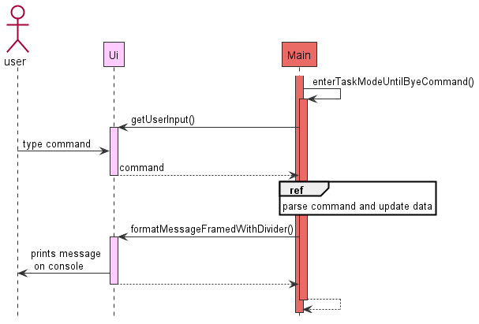

Step 1: The main program starts off with the `run()` method (method not shown but the activation bar is present), and the 
`run()` method self invokes itself by calling `enterTaskModeUntilByeCommand()`,\
Step 2: In this method, the `Main` class will prompt for user input using `getUserInput()`.\
Step 3: Once the `Ui` instance received user input, the `Main` class will process the data. This process will be elaborated in [Parsing of Commands](#parsing-of-commands) under [Implementation](#implementation).
Step 4: After processing the data, no matter success or fail, the `Main` class will tap on `Ui` instance again to print
message on the console using `formatMessageFramedWithDivider()`.

Note: The `Main` class has 2 activation bars due to the `run()` method which will then activate 
`enterTaskModeUntilByeCommand()`. In the example above, it is assumed that `bye` command is not used as example.

### **Logic Component**
 
The `Logic` component is responsible for making sense of user input.

Below is a high level class diagram of the `Logic` component, which shows how it interacts with other components 
like `Main`, `Storage` and `Data`.

  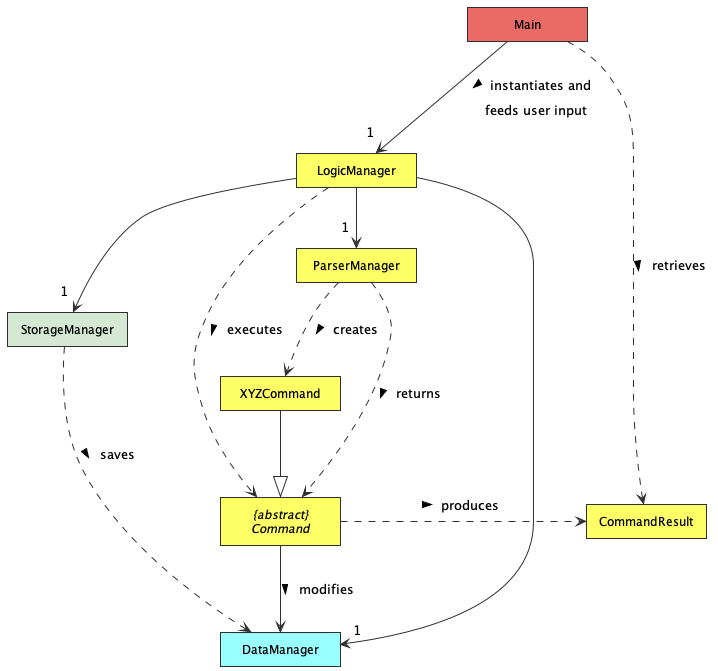 

The general workflow of the `Logic` component is as follows:
1. When the program first starts, `Main` instantiates `LogicManager` and initialises it with `StorageManager` and `DataManager`. At the same time, `ParserManager` is also instantiated within `LogicManager`.
2. Whenever `Main`  receives user input, it feeds this user input to the `LogicManager`.
3. `LogicManager` then calls on `ParserManager` to parse the user input.
4. The `ParserManager` parses the user input and creates a `Command` object.
   - More specifically, it creates a `XYZCommand` object, where `XYZ` is a placeholder for the 
      specific command type, e.g `AddFoodCommand`, `UpdateProfileCommand`, etc.
   - `XYZCommand` class inherits from the abstract class `Command`, which is used to represent all executable commands in the application.
5. `ParserManager` returns the `Command` object to `LogicManager`, which then executes the `Command`.
6. During execution, `Command` will perform data manipulation on `DataManager`.
7. After execution, all `Command` objects stores the result of the execution in a `CommandResult` object. 
This `CommandResult` object is then returned to `LogicManager`.
8. Depending on the type of `Command` being executed which affects the type of data that has been manipulated, `LogicManager` will call upon `StorageManager` to save the affected data to the file system.
9. Finally, `CommandResult` is returned to `Main`.

Here is a more detailed class diagram illustrating the classes within the `Logic` component.

  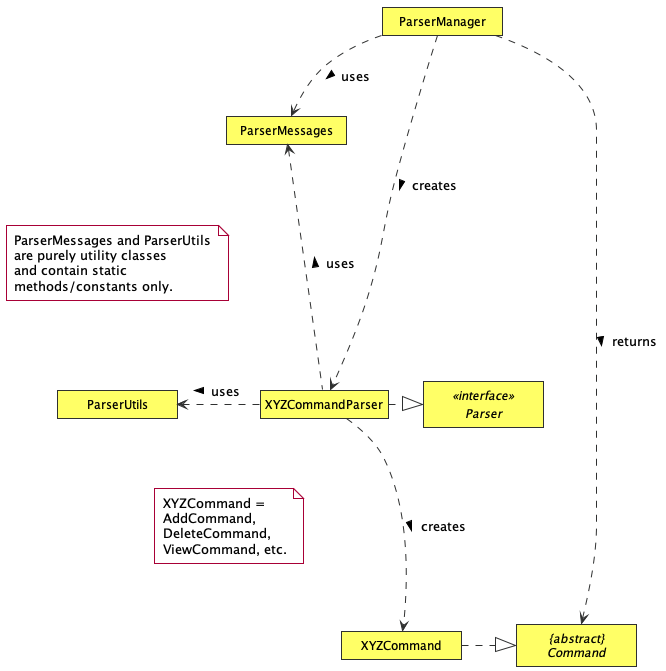

Taking a closer look into the parsing process, the `ParserManager` actually does not do most of the parsing itself. This is how the parsing process works:
1. `ParserManager` creates `XYZCommandParser`,  which is then responsible for creating the specific `XYZCommand`. 
   - All `XYZCommandParser` classes implement the interface `Parser`, which dictates that 
   they are able to parse user inputs. 
   - They also make use of utility methods stored in `ParserUtils` to extract 
   all the parameters relevant to the command, and constants in `ParserMessages` to format the desired output. 
2. After parsing the input, `XYZCommandParser` returns `XYZCommand` to `ParserManager`,
   which then returns the same `XYZCommand` to `LogicManager`.

### **Storage component**

This is a (partial) class diagram that represents the `Storage` component.

  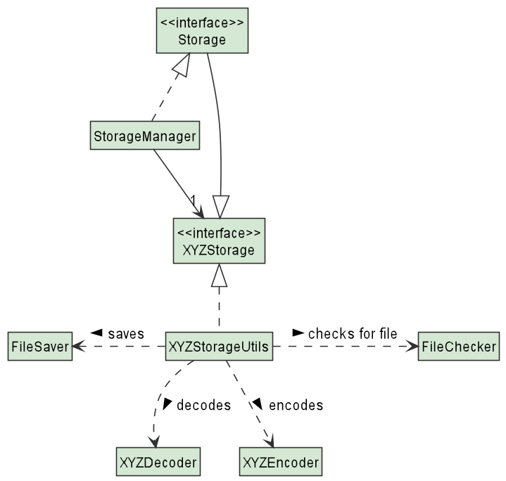

1. Firstly, `Storage` inherits each of the `XYZStorage` interfaces. This ensures the `Storage` API has the relevant load and save functions
of the various storages. 
2. `StorageManager` then implements the `Storage` API that contains the relevant functionalities and instantiates `XYZStorage` using the respective `XYZStorageUtils`.
3. Each of the `XYZStorageUtils` utilizes the general classes of `FileChecker` to create/check for their files and `FileSaver` to write to their respective files.
4. `XYZStorageUtils` also uses `XYZDecoder` to decode files from the saved .txt file and a `XYZEncoder` to encode items into the saved file.

The `StorageManager` component loads and saves:

- your profile: name, height, weight, gender, age, calorie goal and activity factor
- list of exercises done: including date performed
- list of food consumed: including date and time of consumption
- upcoming exercises: recurring exercises that are scheduled in the future
- food and exercise banks: names and calories of relevant item

This way of design ensures that each class has the correct methods to perform its capabilities.

### **State Component**

#### **Create Profile (StartState)**

  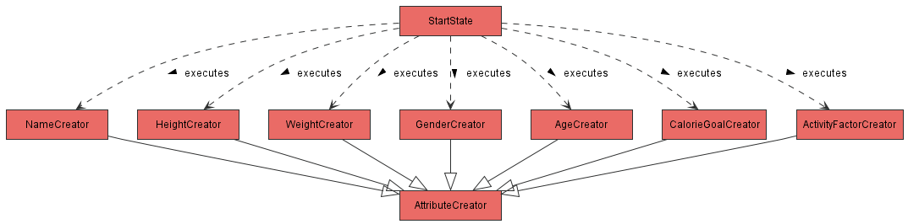

- When the `StartState` method is being called, it instantiated and execute methods in the 7 classes, which are 
`NameCreator`, `HeightCreator`, `WeightCreator`, `GenderCreator`, `AgeCreator`, `CalorieGoalCreator` and 
`ActivityFactorCreator`.
- The above Classes instantiated by `StartState` are inherited from `AttributeCreator` class. These profile attributes
are inherited from `AttributeCreator` to conform DRY principle, by extracting out common methods.

### **Implementation**

This section describes some noteworthy details on how certain features are implemented
and some design considerations.

❗️ **Note**: Due to limitations of PlantUML, the lifeline in sequence diagrams does not end at the destroy marker (X) as it should, but reaches the end of the diagram instead.

#### **Parsing of Commands**
The sequence diagram below models the interactions between the different classes within the Logic component.
This particular case illustrates how a user input add f/potato c/20 is parsed and process to execute the appropriate actions.

  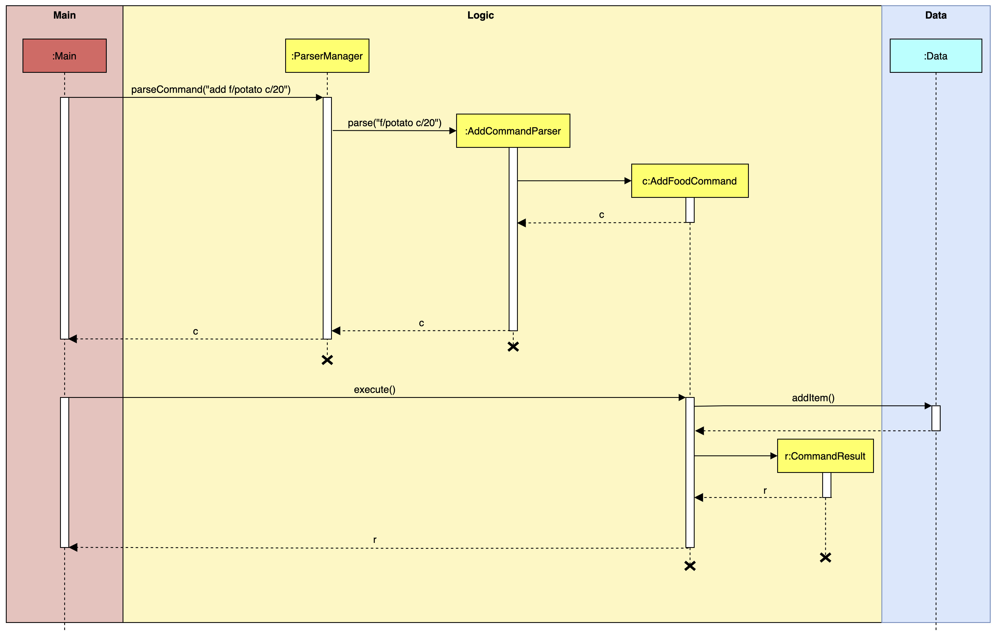

Step 1: When the program first starts, `Main` instantiates `LogicManager`, and initialises it with the objects `storageManager` and `dataManager`. This is so that `LogicManager` has access to the storage and data components.

Step 2: `LogicManager` then instantiates a `ParserManager` object. This is the class where all the parsing of commands will occur.

Step 3: In the case where `Main` receives the user input `add f/potato c/30`, `Main` will call the method `execute` from `LogicManager`, and provides the user input as the argument.

Step 4: `LogicManager` then calls the `parseCommand` method from `ParserManager`. Now, `ParserManager` will start to parse the user input.

Step 5: Firstly, `ParserManager` has to determine the type of `Command` it is trying to parse. The details of this process is shown in the sequence diagram below.

  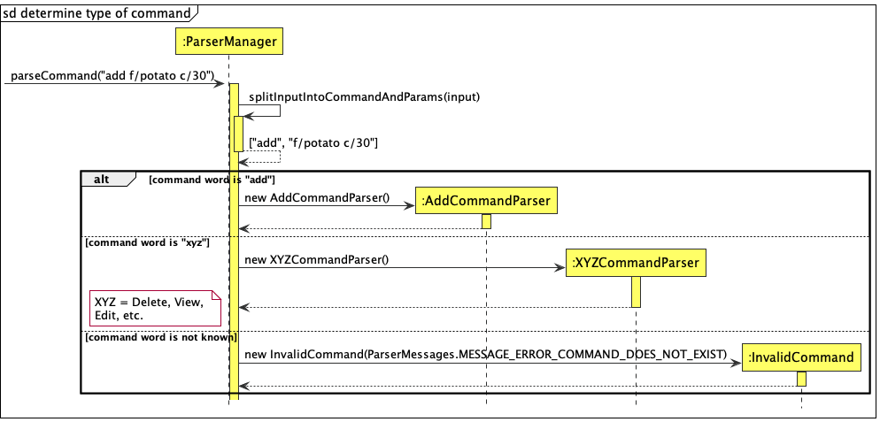

Step 6: As seen in the above diagram, `ParserManager` first splits the input into command word and the remaining parameters. In this case, the command word is `add`, and the parameters are `f/potato c/30`. 

Step 7: Depending on the command word, `ParserManager` will then instantiate the appropriate `XYZCommandParser`. In this case, since the command word is `add`, an `AddCommandParser` object is created. 
However, if the command word is not known to the program (i.e. is not equal to any `XYZ` specified), an `InvalidCommand` will be created and returned immediately.

Step 8: After the appropriate `AddCommandParser` is created, `ParserManager` will then call the method `parse` on the `AddCommandParser`. `AddCommandParser` will then start to parse all the required parameters specific to the `AddCommand`. This process is explained in detail in the below sequence diagram.

  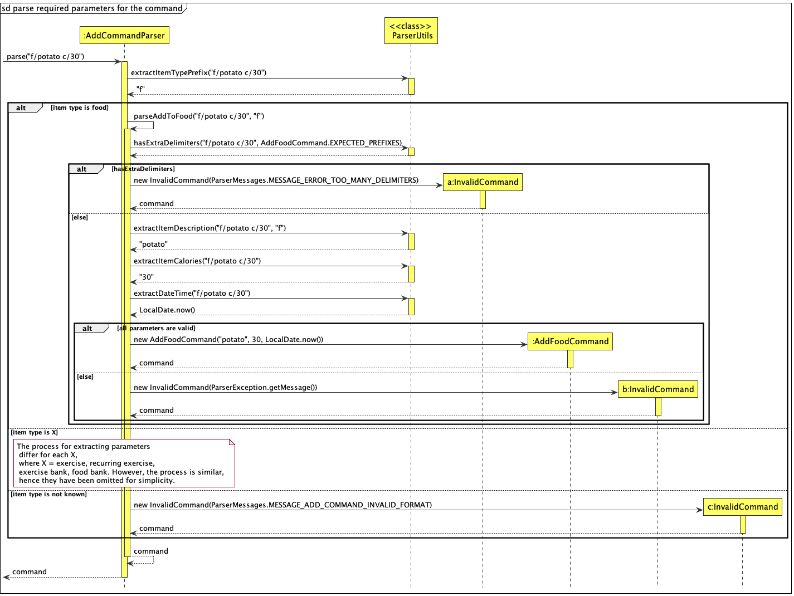

Step 9: Since the `AddCommand` can be called for different items in the program, such as `FoodList`,  `ExerciseList`, etc., `AddCommandParser` will first call the `extractItemTypePrefix` method from `ParserUtils`. 
Note that all methods from `ParserUtils` are static as `ParserUtils` is purely a utility class. This method will extract the item type prefix, which is the first parameter provided after the command word. In this case, `f` is extracted and returned to `AddCommandParser`.
If at this point the item type prefix extracted is not known to the program, an `InvalidCommand` will be created and returned immediately. 

Step 10: After determining that the `AddCommand` is to be performed on the `FoodList`, `AddCommandParser` will call its own method, `parseAddToFood`.

Step 11: Inside the method `parseAddToFood`, `AddCommandParser` will first call the method `hasExtraDelimiters` from `ParserUtils` to determine if there are extra `/` characters in the input, which would make it invalid. If yes, an `InvalidCommand` will be created and returned immediately.

Step 12: Then, `AddCommandParser` will call the relevant methods from `ParserUtils` to extract specific parameters. In this case, the methods `extractItemDescription`, `extractItemCalories` and `extractDateTime` are called.

Step 13: If all the parameters extracted are valid, then `AddCommandParser` will instantiate and initialise an `AddFoodCommand` object with the extracted details. Else, if any of the parameters are invalid, an `InvalidCommand` would be created and returned immediately.

Step 14: The instantiated `Command` object is then returned to `ParserManager`, which then returns it to `LogicManager`. In this case, `AddFoodCommand` is returned.

Step 15: `LogicManager` then calls the method `setData` on `AddFoodCommand` to provide it with the program's data. 

Step 16: `LogicManager` then calls the method `execute` on `AddFoodCommand` to perform the data manipulation process. For example, in this case, a food item will be added to the `FoodList`. The details of this process is not shown here, but can be seen in [this section](#add-a-food-item-feature).

Step 17: Finally, `AddFoodCommand` instantiates a `CommandResult` object representing the result of the execution. This `CommandResult` is then returned to `LogicManager`, which then returns it to `Main`. 

#### **Add a Food Item Feature**

  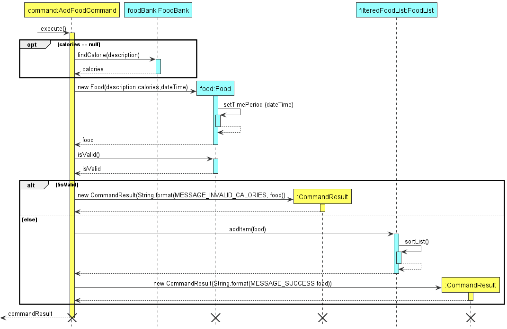

The purpose of this feature is to allow the user to add food item to the food list. The above diagram shown is the 
sequence diagram of the process of adding the food item. 

When the user gives an input, `ParserManager` from the `Logic` component will try to read the input, and then call the correct
command. In this case we assume that the correct format of **Add Food** input is given and the `AddFoodCommand` has already been
called and created.

Step 1: When the `execute` method in the `AddFoodCommand` is being called, it will first check that if the `calories` is equal to null. If this
condition is true, meaning that the user does not provide the calorie value of the food item, thus the item is expected to be found in the `FoodBank`.

Step 2: Once the calorie value is determined, whether from `FoodBank` or user input, the AddFoodCommand then call the constructor
of the `Food`. When the `Food` constructor is called, it will perform a [self-invocation](#self-invocation)`setTimePeriod` to set the enum value `timePeriod`
of the Food. After that, it returns the Food object to the `AddFoodCommand`.

Step 3: The newly created Food object `food` is checked if it has a valid calorie value by calling the method `isValid()` in `Food` class. This
method returns a boolean result `isValid` to `AddFoodCommand`. Then the program will enter an `alt` block which determines whether the `food` object
should be added to the `foodList`.

Step 4a: If the calorie value is invalid, the boolean `isValid` will be false. When this condition is satisfied, it will enter the first
alternative path, which then creates a `CommandResult` class object that contains the message to inform the user that the calorie value
is incorrect. In this path, no food item is added to the `foodList`. This `CommandResult` object is returned to the `AddFoodCommand`.

Step 4b: If the calorie value is valid, the boolean `isValid` is true, the `AddFoodCommand` will call the method `addItem` from the `FoodList` object, which performs the add food operation in the
`Food List`. After the new `Food` Item is added, it will perform a [self-invocation](#self-invocation) `sortList` to sort the `FoodList` according to 
the date and time of all the food items inside the list. Since the `addItem` method is void type, nothing is returned to `AddFoodCommand`.
 After the `addItem` method is executed without giving any error, the `AddFoodCommand` then calls a `CommandResult` object that contains the message indicating the command is executed
successfully. This `CommandResult` object is returned to the `AddFoodCommand`.

Step 5: Once the `CommandResult` class object is returned, the `AddFoodCommand` then return this `commandResult` to the class that calls it. 
At this stage, the `AddFoodCommand` execution is successfully ended.

After all the steps are done, the objects of class `AddFoodCommand`, `Food` and `CommandResult` are no longer referenced and hence get removed
by the `Garbage Collector` in Java. However ,the lifeline of `foodBank` and `foodList` objects are still continuing because they
are created in `DataManager` class and have the potential to get referenced by other commands call such as `add`, `delete`, `view` and `edit`.

One may also observe that the lifeline does not end even though the object is deleted and no longer be referenced. This problem
is due to the flaw of the drawing tool, *PlantUml* used. For a more accurate sequence diagram, the lifeline should end immediately
once the object is no longer referenced.

#### **Design considerations:**

The current data structure used in `FoodList` is [Array List](#array-list). The rationale of choosing an array list implementation is because
it supports resizability and random accessibility. However, the drawback of such an array list is that sorting requires 
O(n2), which slows down the code efficiency. In the future increment, alternative data structures such as
[Priority Queue](#priority-queue) and [Min Heap](#min-heap) can be implemented to achieve O(logn) addition and they are
naturally sorted and thus no additional sorting required.

The same reasoning for the class `ItemBank`, which is the superclass of `FoodList` and `ExerciseList`,the current implementation
data structure is also an [Array List](#array-list). In the future increment, since the `ItemBank` need to perform query 
operation frequently and the items inside need to be sorted alphabetically, the data structure of the attribute will be changed 
to [TreeMap](#tree-map) to achieve O(logn) query time.

#### **Add a Recurring Exercise Feature**

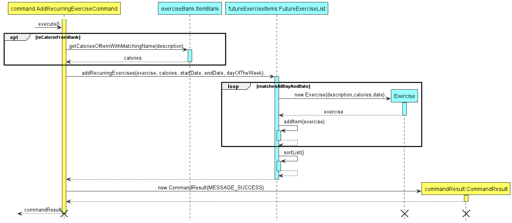

The purpose of this feature is to allow the user to add recurring exercises to the future exercise list. The above diagram 
is the sequence diagram of adding recurring exercises to the future exercise list, assuming that the user input satisfies the restrictions
and does not cause any errors to be thrown.

Step 1: The `ParserManager` from the `Logic` component parses the input given by the user and calls the `execute` method in
`AddRecurringExerciseCommand`. The condition `calories == null` is checked to see if the user input any calories for
the recurring exercise. If it is `true`, it means that no calories input is detected and the method 
`findCalories` in class `ItemBank` is called, and it will return an int value of `calories`.

Step 2: Within `execute` method, `addRecurringItem` method in `FutureExerciseList` is also called. This method will 
iteratively call the constructor for `Exercise` class and add the exercises into `FutureExerciseList` via the self-invocation
`addItem` method. This iteration will end when all exercises on `dayOfTheWeek` between `startDate` and `endDate` are added.

Step 3: After `addRecurringExercises` method is executed, `AddRecurringExerciseCommand` calls a `CommandResult` object.
This object outputs a message and `AddRecurringExerciseCommand` will return `commandResult`, indicating that
`AddRecurringExerciseCommand` is successfully executed and ended.

#### **Loading of Data On StartUp**

There are many files that are used for our current implementation. 
Therefore, since they are similar in behaviour and function, we will only be looking at the loading of the Profile component on the starting up of _Fitbot_.

  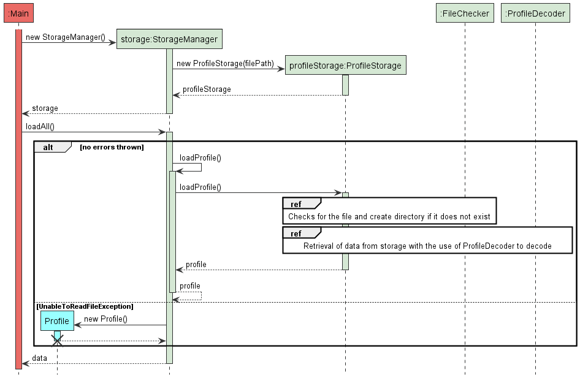

Upon successful launch of the application, `Main` will call to initialize `StorageManager`. 
This in turn initializes all the subclasses of `Storage`, including `ProfileStorage`, with their respective file paths. 
Afterwhich, `Main` calls a loading function `loadAll` that calls an internal `loadProfile()` function (self-invocation). This then calls the `loadProfile()` method of `ProfileStorage`.

`ProfileStorage` then does 2 main things: 

1. Checks and creates the file if it is missing.
2. Retrieves the data from the file with the use of the ProfileDecoder to decode.

  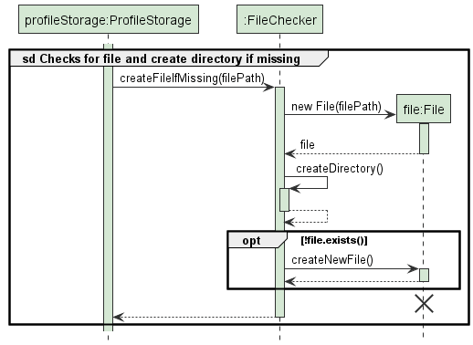

<i>Reference Diagram: Checks for the file and create directory if it does not exist</i>

The diagram above explains how the application checks if a file exists. If it exists, it will not perform any additional functionality. Otherwise, it will generate a new file in preparation for storage.

  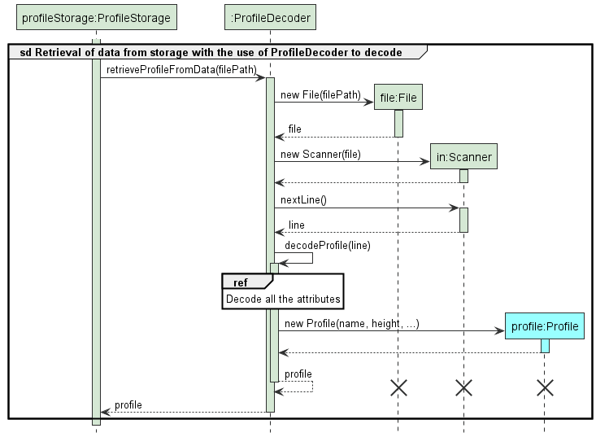

<i>Reference Diagram: Retrieval of data from storage with the use of ProfileDecoder to decode</i>

The diagram above explains the processes to decode the items from the file.

Upon reaching the `decodeProfile(line)` method, the reference frame depicts a process of decoding its attributes one by one to ensure that they are able to detect each attribute's readability from storage.
If the methods are unable to read the respective attribute from storage, an invalid attribute will be initialized. This then returns an initialized profile with invalid attributes for `StartState` to catch, allowing users to change
their attributes instead of losing their entire profile data on startup. 

  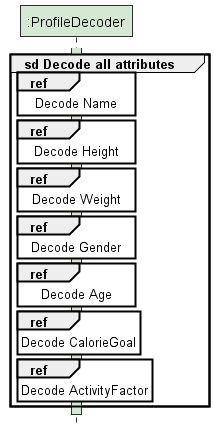

<i>Reference Diagram: Decode all attributes</i>

Below represents each of the attribute's decoding process:

  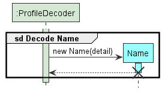

<i>Reference Diagram: Decode Name</i>

  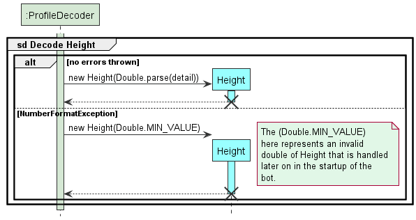

<i>Reference Diagram: Decode Height</i>

  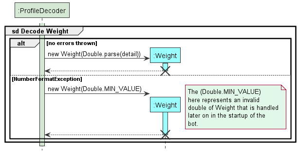

<i>Reference Diagram: Decode Weight</i>

  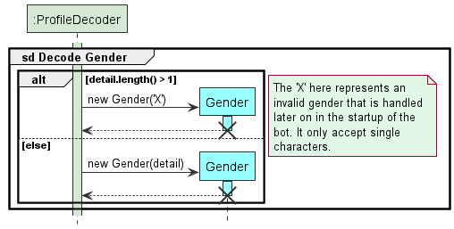

<i>Reference Diagram: Decode Gender</i>

  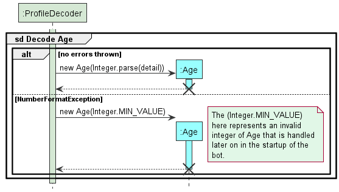

<i>Reference Diagram: Decode Age</i>

  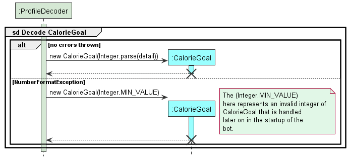

<i>Reference Diagram: Decode CalorieGoal</i>

  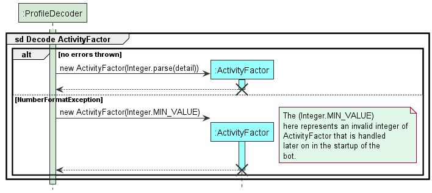

<i>Reference Diagram: Decode ActivityFactor</i>

The other storages load in a similar fashion to this, except for each decoder, they decode `Item` for `ItemBank`s, `Food` for `FoodList` and `Exercise` for `ExerciseList`.

#### **Create Profile If Not Exist On Startup**

When user first enters _Fitbot_, the profile of the user is not set up (attributes may not exist). If user were to 
interact with the application, there might be incorrect output, 
therefore the `checkAndCreateProfile()` is implemented to check whether the profile exist
and if it does not exist, _Fitbot_ will guide user through to fill up the profile attributes.

  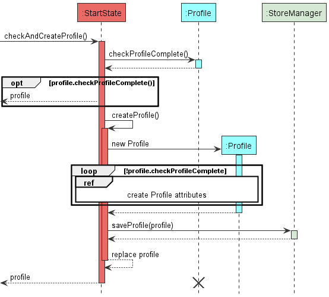

On startup, the main function will run `checkAndCreateProfile()` (not in diagram), which will cause StartState
instance to be created by dataManager and run  `new StartState.checkAndCreateProfile()`.

Step 1: the `checkAndCreateProfile()` will check if there is a profile exist, by checking all the attributes. 
If all attributes are correct, the profile will be returned. If there is all the attributes are incorrect or there is no
attribute in storage, the StartState will self invocate by calling `createProfile()`.

Step 2: `createProfile()` will instantiate a new profile instance. Using a while loop to check whether all attributes
 have been updated, the `createProfile()` will ensure that all attributes in the new profile instance are valid before 
proceeding to next step.

Step 3: Once all the profile attributes are set up, it will store the profile attributes into storage, by calling 
`saveProfile()` in StorageManager class. 

Step 4: The StartState will replace the reference of old profile instance with the new profile instance
(not shown in diagram).  Since the old profile instance is being dereferenced, it has reached the end of the lifeline,
shown by a cross at its lifeline. The profile in the StartState will then be returned to the dataManager.

#### **Design Considerations**

The purpose of replacing the new profile with the old profile is to ensure that if the new user decides to close the 
program without finishing creating profile, the profile attributes keyed in by the user will not be saved. It will only 
save all the profile attributes when all the attributes has been inputted by the user are present and valid.

## **Product scope**
### **Target user profile**

University students who are looking to keep track of their calorie consumption and calorie outputs.

### **Value proposition**

During these restricted COVID-19 times, we are confined to home-based learning. As a result, we tend to be less active and have fewer opportunities to stay active. This app aims to help you to gain or lose weight based on your goal of implementing a calorie deficit or calorie surplus.

Its overview shows your progress over the weeks, indicating whether or not you have hit your daily calorie goal target for the past 7 days.

## **User Stories**

|Version| As a ... | I want to ... | So that I can ...|
|--------|----------|---------------|------------------|
|v1.0|new user|see usage instructions|refer to them when I forget how to use the application|
|v1.0|new user|want to store food records|track my food intake|
|v1.0|new user|want to store exercise records| track my exercises|
|v1.0|new user|delete exercise records| amend wrong inputs|
|v1.0|new user|delete food records| amend wrong inputs|
|v1.0|new user|to see how close or how far i am from the calorie target| so that I could manage my calorie input|
|v1.0|new user|save my profile data|reduce the hassle of typing repeatedly upon application startup|
|v1.0|new user|calculate BMI|gauge whether I am in the healthy range|
|v1.0|new user|store all records|refer to them whenever needed|
|v2.0|new user|have a profile| to keep track of all information to calculate my net calories|
|v2.0|user|find a to-do item by name|locate a to-do without having to go through the entire list|
|v2.0|user|set up profile first before entering application|so that a more accurate analysis could be done|
|v2.0|user|have a summary|see my calorie targets
|v2.0|user|have a history|spend less time typing all the requirements to store items|
|v2.0|user|have an exercise list that update itself|have more time for exercises|
|v2.0|user|have a sorted food list|see what I have eaten on different times of the day|
|v2.0|user|have varying inputs methods|reduce unnecessary hassle|
|v2.0|user|have a delete all command|start afresh|
|v2.0|user|have sorted food list|view the meals I have eaten throughout the week|
|v2.0|user|have sorted food list by meal time|track the number of supper meals I have in a week|
|v2.0|frequent user|have the ability to edit past records|edit past wrong inputs|
|v2.0|university student|be able to store weekly recurring sports activities|reduce hassle of input entries|
|v2.0|body-conscious user|calculate net calories inclusive of BMR|have a more accurate gauge of calories burnt|

## **Non-Functional Requirements**

1. Should work on any OS as long as it has Java 11 or above installed on their PC.
2. Should be able to hold up to at least a year of data without a slowdown of performance in daily use.
3. Any user that is comfortable with typing of speeds >55 words per minute would be able to accomplish these tasks faster than if they used a mouse to navigate.

## **Glossary**

#### _self invocation_
In UML sequence diagram, a method that does a calling to another of its own methods is called self-invocation. 
#### _array list_
A linear data structure that inherits Java `List` implementation and `Array` implementation. It behaves like a normal array,
except that it is resizable. Moreover, the amount of time taken for reallocation the elements when capacity grows is a constant
time. In Java, array list can be implemented using `ArrayList` in `Collection`.
#### _priority queue_
An abstract data type similar to a regular queue or stack data structure in which elements in priority queue are ordered
and have "priority" associated with each element. The priority can be defined by the coder. In the case of `FoodList`, the
priority will be defined as earlier date and time will have higher priority.
#### _min heap_
The implementation of min heap is almost the same as priority queue, in which it is sorted according to some "priority" 
constraint. In addition, a min heap can be modelled as a [binary tree](https://en.wikipedia.org/wiki/Binary_tree) structure
having all the parent nodes smaller or equal to its children nodes. 
#### _tree map_
A tree map is a combination of tree structure and hash map structure. In Java, tree map is implemented using a self-balancing
[Red-Black tree](https://www.geeksforgeeks.org/red-black-tree-set-1-introduction-2/) structure and it is sorted according
to the natural order of its keys. In the case of `ItemBank`, the key should be the String type of the `Item` description, 
which will be sorted lexicographically. \
(more coming in the future...)

## **Instructions for manual testing**

Given below are some instructions that can be used to test the application manually. 

### **Launch**

1. Initial launch
   - Prerequisite: There is no Fitbot.jar file on your desktop.
   - Test case:
      1. Download the jar file and copy into an empty folder
      2. Go to your command prompt, and go into your directory.
      3. Run the command `java -jar Fitbot.jar`.

   Expected: a data folder will be created in the file that contain Fitbot.jar.

### **Setting Up Profile**

1. Setting Up Profile I
   - Prerequisite: Fitbot.jar is in a folder with or without data folder.
   - Test case:
   1. Delete profile.txt from data folder if present.
   2. Run _Fitbot_ using `java -jar Fitbot.jar`.

   Expected: _Fitbot_ will prompt for your name upon start up.

2. Setting Up Profile II
   - Prerequisite: profile.txt is present.
   - Test case:
     1. Change 1 of the attribute to an invalid attribute.
     2. Run _Fitbot_ using `java -jar Fitbot.jar`.\
   Expected: _Fitbot_ will prompt for the attribute missing.

3. Setting Up Profile III
    - Prerequisite: profile.txt is deleted/ not present.
    - Test case:
   1. When being asked to type a name, type the command `bye`.\
   Expected: A question shows up to confirm with the user whether the user wants to exit the program or wants to set his or her
      name as "bye". The user then need to type 1 to exit the program, 2 to set the name as "bye" and any other key to go back.
   2. Restart the program, checks whether profile.txt is deleted/ not present.
   3. Fill in some of the profile attributes. Do not fill up all of them.
   4. Type the command `bye`.\
   Expected: _Fitbot_ is able to exit.

### **Customising Profile**

1. Viewing current profile:
   1. Prerequisite: Have an initialized profile after the startup of the program
   2. Test case: `profile`\
   Expected: Displays your profile in a viewable format
2. Changing attributes:
   1. Prerequisite: Have an initialized profile after the startup of the program
   2. Test case: `profile n/John|`\
   Expected: Name is not changed as the use of `|` character is illegal.
   3. Test case: `profile n/John/`\
   Expected: Name is not changed as the use of `/` character is also illegal.
   4. Test case: `profile h/-20` \
   Expected: An error message shows that you can only input a number between 1 and 300, and height will not change.
   5. Test case: `profile w/-200` \
   Expected: An error message shows that you can only input a number between 1 and 300, and weight will not change.
   6. Test case: `profile a/170`\
   Expected: An error message shows that you can only input a whole number between 10 and 150.
   7. Test case: `profile s/mfe`\
   Expected: Error message displays that you should only use 'M' or 'F' only.
   8. Test case: `profile g/20000`\
   Expected: Error message that displays that you can only input from -3000 to 10000.
   9. Test case: `profile x/0`\
   Expected: Error message asking you to try a whole number from 1 to 5 instead.
   10. Test case: `profile x/2 w/90 h/190 a/22 s/m g/500 n/Johnny English`\
   Expected: Profile will change even with the parameters not being in order. This allows users flexibility to change their attributes in any order and with whichever parameters they want. (At least 1 attribute and at max 7 attributes can be changed at once)

### **Recording Food Items:**

1. Adding a new Food Item when the Food List is empty:
   1. Prerequisite: Checks if the food list is empty using `view f/`. An output message showing that
   the current food list is empty is expected.
   2. Test case: `add f/chicken rice c/607` \
   Expected: New Food Item is added to the Food List. A message telling the user that a new food item has been added will show up. 
   The date and time are the date and time when the user call this command.
   3. Test case: `add f/chicken rice c/607 d/x t/1200` (where x is a date in DD-MM-YYYY format and within 7 days of today)\
   Expected: No Food Item is added to the Food List. A message will show up and tell the user that 
   the date must be within 7 days of today.
2. Viewing a new Food Item:
   1. Test case: `view f/` when the Food List is empty\
   Expected: No food item shown. A message will show up, telling the user that there is no food items within 7 days of today.
   2. Test case: `view f/` after calling `add f/chicken rice c/607`\
   Expected: The output will show the food list with at least one food item chicken rice, with calorie 607 cal and the date and 
   time is when the user called the `add` command.
3. Deleting Food Item:
    1. Prerequisite: Simply replace the date to any date that is within 7 days of today date. The time field is also optional
   and can be replaced with any valid timing.
    2. Test case: `delete f/1 d/x t/1400` when the Food List is empty (where x is a date in DD-MM-YYYY format and within 7 days of today)\
   Expected: No food item is deleted. The output will show a message telling the user that the Food List is empty.
    3. Test case: `delete f/1 d/x t/1400` after calling `add f/chicken rice c/607 d/x t/1400` (where x is a date in DD-MM-YYYY format and within 7 days of today)\
   Expected:  The food item with index 1 is removed. The output will show a message teling the user that the food item
   is deleted. (Note that the food item will be `chicken rice` if there is only one food in the food list)
    4. Test case: `delete f/-1 d/x t/1400` (where x is a date in DD-MM-YYYY format and within 7 days of today)\
   Expected: No food item is deleted. The output will show a message telling the user that the input index should be a
   number that is greater than 0.
    5. Test case: `delete f/all` \
   Expected: All Food Items in the Food List are deleted. Message will show up and inform the user that all food items
   in the Food List are deleted.
    
### **Recording Exercise Items**

1. Adding Exercise Items
    1. Prerequisite: View the current Exercise List using `view e/`.
    2. Test case: `add e/running c/200` \
       Expected: A new Exercise Item is added to the Exercise List. Details of the added exercise are shown.
       The date of the exercise is the date when the user calls this command.
    3. Test case: `add e/running c/200 d/x` (where x is a date in DD-MM-YYYY format and within the past 7 days of today) \
       Expected: A new Exercise Item is added to the Exercise List. Details of the added exercise are shown.
       The date of the exercise is the date that the user input.
    4. Test case: `add e/running c/200 d/x` (where x is a date in DD-MM-YYYY format and more than 7 days ago) \
       Expected: No Exercise Item is added to the Exercise List. Error message will show up and inform the user that
       a valid date within 7 days of today is required.
2. Viewing Exercise Items
    1. Test case: `view e/` when the Exercise List is empty\
       Expected: Message indicating that the Exercise List is empty is shown.
    2. Test case: `view e/` when the Exercise List is not empty\
       Expected: All of the Exercise Items are displayed.
3. Deleting Exercise Items
    1. Prerequisite: View the current Exercise List using `view e/`.
    2. Test case: `delete e/1 d/x` when the Exercise List is empty (where x is a date in DD-MM-YYYY format and within 7 days of today)\
       Expected: No Exercise Item is deleted from the Exercise List. Error message will show up and inform the user that
       the Exercise List is empty.
    3. Test case: `delete e/1 d/x` when the Exercise List contains at least one exercise with date x (where x is a date in DD-MM-YYYY format)\
       Expected:  The Exercise Item with index 1 is deleted. Details of the deleted exercise are shown.
    4. Test case: `delete e/2 d/x` when the Exercise List contains only one exercise with date x (where x is a date in DD-MM-YYYY format)\
       Expected: No Exercise Item is deleted from the Exercise List. Error message will show up and inform the user that
       the Exercise Item with index 2 on date x is not found in the Exercise List.
    5. Test case: `delete e/all` \
       Expected:  All Exercise Item in the Exercise List are deleted. Message will show up and inform the user that all exercises
       in the Exercise List are deleted.

### **Scheduling Exercises**

1. Adding Upcoming Exercise Items
    1. Prerequisite: View the current Upcoming Exercise List using `view u/`.
    2. Test case: `add e/running c/200 d/x` (where x is a date in DD-MM-YYYY format and one year within the future) \
       Expected: A new Upcoming Exercise Item is added to the Upcoming Exercise List. Details of the added upcoming exercise are shown.
    3. Test case: `add e/running c/200 d/x` (where x is a date in DD-MM-YYYY format and more than one year in the future) \
       Expected: No Upcoming Exercise Item is added to the Upcoming Exercise List. Error message will show up and inform the user that
       a valid future date within one year from today is required.
2. Adding Recurring Exercise Items
    1. Prerequisite: View the current Upcoming Exercise List using `view u/`.
    2. Test case: `add r/running c/200 :/x -/y @/1,3 ` when y occurs after x (where x and y are dates in DD-MM-YYYY format and both one year within the future) \
       Expected: Upcoming Exercise Items that occur on Monday and Wednesday (`@/1,3`) between date x and y are added to the Upcoming Exercise List. 
       A message will show up, indicating that the recurring exercises have been added.
    3. Test case: `add r/running c/200 :/x -/y @/1,3 ` when x occurs after y (where x and y are dates in DD-MM-YYYY format) \
       Expected: No Upcoming Exercise Item is added to the Upcoming Exercise List. Error message will show up and inform the user that
       y should occur after x.
    4. Test case: `add r/running c/200 :/x -/y @/1,3 ` when y occurs after x (where x and y are dates in DD-MM-YYYY format and one or more of them are more than one year in the future) \
       Expected: No Upcoming Exercise Item is added to the Upcoming Exercise List. Error message will show up and inform the user that
       both x and y should be within one year in the future.
    5. Test case: add r/running c/200 :/x -/y @/1,3  (where x and y are dates in DD-MM-YYYY format and one or more of them are in the past)\
       Expected: No Upcoming Exercise Item is added to the Upcoming Exercise List. Error message will show up and inform the user that
       both x and y should be within one year in the future.

3. Viewing Upcoming Exercise Items
    1. Test case: `view u/` when the Upcoming Exercise List is empty\
       Expected: Message indicating that the Upcoming Exercise List is empty is shown.
    2. Test case: `view u/` when the Upcoming Exercise List is not empty\
       Expected: All of the Upcoming Exercise Items are displayed.
4. Editing Upcoming Exercise Items
    1. Prerequisite: View the current Upcoming Exercise List using `view u/`.
    2. Test case: `edit u/` \
       Expected: No Upcoming Exercise Item is edited. Error message will show up and inform the user that there should be an input for item number.
    3. Test case: `edit u/1` \
       Expected: No Upcoming Exercise Item is edited. Error message will show up and inform the user that there should be an input for the details to be edited.
    4. Test case: `edit u/1 n/runnning` when the Upcoming Exercise List is empty \
       Expected: No Upcoming Exercise Item is edited. Error message will show up and inform the user that the Upcoming Exercise List is empty.
    5. Test case: `edit u/1 n/running` when the Upcoming Exercise List is not empty \
       Expected: The name of the Upcoming Exercise List with index 1 in the Upcoming Exercise List is updated to 'running'. Details of the newly updated Upcoming Exercise Item will be shown.
5. Deleting Upcoming Exercise Items
    1. Prerequisite: View the current Exercise List using `view u/`.
    2. Test case: `delete u/1` when the Exercise List is empty\
       Expected: No Upcoming Exercise Item is deleted from the Upcoming Exercise List. Error message will show up and inform the user that
       the Upcoming Exercise List is empty.
    3. Test case: `delete u/1` when the Upcoming Exercise List contains at least one upcoming exercise\
       Expected:  The Upcoming Exercise Item with index 1 is deleted. Details of the deleted upcoming exercise are shown.
    4. Test case: `delete u/1,2,3` when the Exercise List contains three or more upcoming exercises\
       Expected: The Upcoming Exercise Items with index 1, 2, 3 are deleted. Details of all the deleted upcoming exercises are shown.
    5. Test case: `delete u/all` \
       Expected:  All Upcoming Exercise Items in the Upcoming Exercise List are deleted. Message will show up and inform the user that all upcoming exercises
       in the Upcoming Exercise List are deleted.

### **Building Food Bank**
1. Adding Food Bank Items
   1. Prerequisite: Food Bank does not contain a Food Item with the name "potato".
   2. Test case: `add fbank/potato` \
      Expected: Error as the item's calorie details were not provided. 
   3. Test case: `add fbank/potato c/250`\
      Expected: Food Item with name 'potato' and calories '250' has been added to Food Bank.
   4. Test case: `add f/potato` \
      Expected: Food Item with name 'potato' and calories '250' has been added to Food List. User no longer has
      to provide the calorie details for 'potato' as it can be retrieved from the Food Bank.
   5. Test case: `add fbank/potato c/300`\
      Expected: Error as the name "potato" already exists in the Food Bank, and all names in the Food Bank need to be unique.
2. Viewing Food Bank Items 
   1. Test case: `view fbank/` \
      Expected: Shows the list of Food Items in the Food Bank.
   2. Test case: `view fbank/a` \
      Expected: Invalid format. The command word `view` must be followed by `fbank/` exactly.
3. Editing Food Bank Items
   1. Prerequisite: Food Bank contains at least one Item. To find the index of the Item you want to edit, use `view fbank/`.
   2. Test case: `edit fbank/` \
      Expected: Error as there is no input for item number.
   3. Test case: `edit fbank/1` \
      Expected: Error as you need to specify what to edit about this Item.
   4. Test case: `edit fbank/1 n/tomato` \
      Expected: Item number 1 in the Food Bank has been changed to 'tomato' (provided that you do not already have an Item named 'tomato' in the Food Bank).
4. Deleting Food Bank Items
   1. Prerequisite: Food Bank contains at least 3 Items. To find the index of the Item you want to delete, use `view fbank/`.
   2. Test case: `delete fbank/1,2` \
      Expected: Food Bank Items 1 and 2 have been deleted.
   3. Test case: `delete fbank/1` \
      Expected: Food Bank Item 1 has been deleted.
   4. Test case: `delete fbank/x`, where x is any number bigger than the size of the list. \
      Expected: Error as x is out of the range of the item list.
   5. Test case: `delete fbank/all` \
      Expected: All items in the Food Bank have been deleted.
   
### **Building Exercise Bank**

1. Adding Exercise Bank Items
    1. Prerequisite: Exercise Bank does not contain a Exercise Item with the name "30 mins jogging".
    2. Test case: `add ebank/30 mins jogging` \
       Expected: Error as the item's calorie details were not provided.
    3. Test case: `add ebank/30 mins jogging c/500`\
       Expected: Exercise Item with name '30 mins jogging' and calories '500' has been added to Exercise Bank.
    4. Test case: `add e/30 Mins Jogging` \
       Expected: Exercise Item with name '30 Mins Jogging' and calories '500' has been added to Food List. User no longer has
       to provide the calorie details for '30 Mins Jogging' as it can be retrieved from the Exercise Bank, since the match for item name in the Item Banks is case-insensitive.
    5. Test case: `add ebank/30 mins jogging c/300`\
       Expected: Error as the name "30 mins jogging" already exists in the Exercise Bank, and all names in the Exercise Bank need to be unique.
2. Viewing Exercise Bank Items
    1. Test case: `view ebank/` \
       Expected: Shows the list of Exercise Items in the Exercise Bank.
    2. Test case: `view ebank/a` \
       Expected: Invalid format. The command word `view` must be followed by `ebank/` exactly.
3. Editing Exercise Bank Items
    1. Prerequisite: Exercise Bank contains at least one Item. To find the index of the Item you want to edit, use `view ebank/`.
    2. Test case: `edit ebank/` \
       Expected: Error as there is no input for item number.
    3. Test case: `edit ebank/1` \
       Expected: Error as you need to specify what to edit about this Item.
    4. Test case: `edit ebank/1 n/cycling` \
       Expected: Item number 1 in the Exercise Bank has been changed to 'cycling' (provided that you do not already have an Item named 'cycling' in the Exercise Bank).
4. Deleting Exercise Bank Items
    1. Prerequisite: Exercise Bank contains at least 3 Items. To find the index of the Item you want to delete, use `view ebank/`.
    2. Test case: `delete ebank/1,2` \
       Expected: Exercise Bank Items 1 and 2 have been deleted.
    3. Test case: `delete ebank/1` \
       Expected: Exercise Bank Item 1 has been deleted.
    4. Test case: `delete ebank/x`, where x is any number bigger than the size of the list. \
       Expected: Error as x is out of the range of the item list.
    5. Test case: `delete ebank/all` \
       Expected: All items in the Exercise Bank have been deleted.

### **Exiting Program**
1. Exiting Program at any time
    1. Prerequisite: Ensures that Fitbot is still running.
    2. Test case: `bye` \
   Expected: A goodbye message will show up, and the program is terminated successfully.
   
### **Manipulating and Saving Data**

1. Manipulating _Profile_ data in the text files directly.
    - Prerequisite: Data folder with profile.txt already present. (You have run through the profile creation at least once)
<ul>
    <ul><li>Procecures:</li>
        <ol>
            <li>Navigate to the <code>/data</code> folder which is in the same directory as your Fitbot.jar)</li>
            <li>
Open the profile.txt with your editor of choice and view the attributes. It should look something like this: <code>john|180.0|65.0|M|22|300|2</code>

                
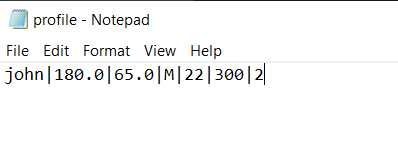

            </li>
            <li>
Edit the height attribute to reflect this: <code>john|BUG|65.0|M|22|300|2</code>

                
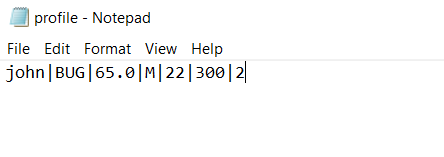

            </li>
            <li>Save the file and try to relaunch the application.</li>
         </ol>   
        <li>Expected: The application should detect the height is invalid and prompts you to change its value inside the application</li>
    </ul>
</ul>

2. Manipulating saved text files, leading to invalid line.
    - Causes of invalid lines in storage: Invalid number of delimiters present, unrecognizable texts and empty spaces (eg. `E|run|309`, where the date field is not present)

<ul>
    <ul>
        <li>
            
Prerequisite: Data folder is present with items already added to lists. (We will be using exercise_list.txt as an example.)

            
Your exercise_list.txt should look something like this:

            
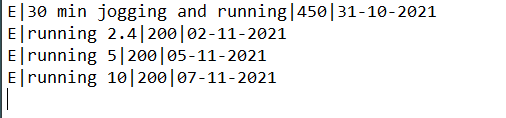

        </li>
        <li>Procecures:</li>
        <ol>
            <li>
Change one of the lines generated by the application with <code>invalid line</code>.

                
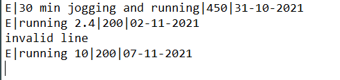

            </li>
            <li>Launch the application where it should be able to detect the invalid line in storage.</li>
         </ol>   
        <li>Expected: The user will be notified of the invalid line and it will be subsequently ignored. Upon the next operation that requires saving of data ("bye", "add e/" commands etc.), this invalid line will be overwritten and ignored, preserving the data integrity of the rest of the lines.</li>
    </ul>
</ul>

   _Note: The dates used here was during the creation of the DeveloperGuide. We have set hard limits to not accept anything past 10 years prior or greater than 1 year into the future for completeness of our data. For instance, you are unable to set a exercise performed in 1991 as it will just ignore the line without notifying the user._

