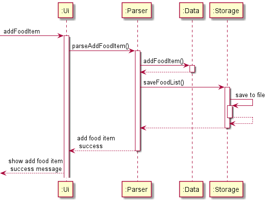
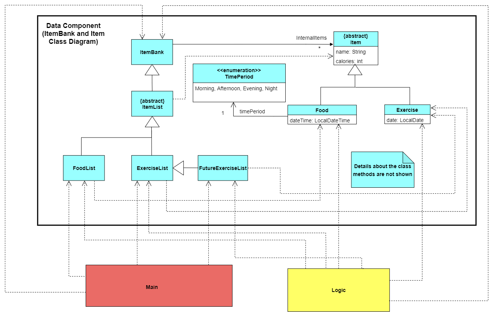
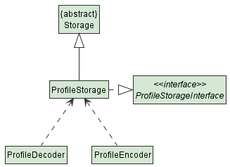

# Developer Guide

## Acknowledgements

{list here sources of all reused/adapted ideas, code, documentation, and third-party libraries -- include links to the original source as well}

## Design & implementation

### Architecture

  <image width="70%" src="images/ArchitectureDiagram.png" alt="Architecture Diagram"/>

`Main` class is the component that interacts with all the necessary classes.
The `Main` class consists of the few components as shown below:
- `Ui`: The interaction between user and application
- `Logic`: Parse commands and execute them respectively
- `Data`: allow users to perform CRUD operations on the data in the application
- `Storage`: stores all data in the application. Saves a copy of data in relevant files.
  Data will be retrieved from storage upon starting of application.

Upon launching of application:
- The application will check if there are files that are already stored in the respective folder.
  If there is such files, the contents of the files will be loaded to the data section of the application.
  Instances of profile, data(e.g. FoodList, ExerciseList, FutureExerciseList, ItemBank) and storage will be created

Upon exiting of application:
- The application will save all data into the files created. All instance of components will be cleared automatically.

Interaction between the classes could be shown by the uml sequence diagram below.

  

When there is an input, the Ui class will retrieve the information from the user.
The information will be parsed by the `Logic` and then upon checking its validity,
it will be saved into the `Data` and `Storage` class.

### Data Component (ItemBank and Item)

  

The `Data` component is responsible to perform operations such as data modification and query in the code. It receives the commands from the `Logic` component, execute the 
correct operations, and finally return the command result back to `Logic` component.\
\
Above is a high-level **_class diagram_** for the `ItemBank` and `Item` classes in `Data` component. Note that since `Main` and `Logic` components have accessed to some classes
in `Data` component, they form **_dependencies_** with those classes.
The main purpose of having `ItemBank` and `Item` classes is to allow user to perform writing, reading, editing and deleting operations in the program.\

#### ItemBank class
`ItemBank` is the **_highest superclass_** that contains one attribute called `internalItems` which is an _array list_ of `item`.\
`ItemList` being the **_subclass_** of `ItemBank` and **_superclass_** of `FoodList` and `ExerciseList`, which inherits all the methods available from `ItemBank`, with additional methods that form a dependency on `Item` class.\
`FoodList` and `ExerciseList` are **_subclasses_** that inherit all the methods available from `ItemList`, while each of them also contains more methods that form a dependency
on `Food` class and `Exercise` class respectively.

#### Item class
An `Item` class contains two attributes, `name` which represents the name of the item, and `calories` which represents the calorie intake/burnt from the item.\
`Food` and `Exercise` are the only two **_subclasses_** inherit the `Item` class. \
`Food` class has two extra attributes called `dateTime` and `timePeriod`, the former stores the consumed food date and time, while the latter compute the time period 
(only value such as **`Morning`, `Afternoon`, `Evening`** and **`Night`** as shown in the enumeration class `TimePeriod`) of the food consumed time. Note that the `timePeriod` 
value must present when a `Food` object is created.\
`Exercise` class has one extra attribute called `date` which stores the date of the exercise taken.\
\
Classes such as `ItemList` and `Item` are _**abstract class**_, because they do not add meaningful value to the user if one tries to create them.

### Data Component (Profile)

  

A Profile class has various attributes such as Name, Height, Weight, Gender, Age, Calorie Goal and Activity Factor

Using these attributes it is able to calculate an estimated Basal Metabolic Rate (BMR) using the Harris-Benedict Equation based on your activity levels. Therefore, while calculating your net calories for the day, your BMR is factored in to give you a more accurate calculation.

TODO\
future exercise list\
foodbank\
exercisebank\
will include some diagrams later\
to complete tp dashboard

###Ui Component

The `Ui` component interacts with the user. It reads in input from the user and prints messages on the console.
Below shows a class diagram of how `Ui` component interacts with the rest of the application.

  

###Logic Component
The `Logic` component is responsible for making sense of user input.

Below is a high level class diagram of the `Logic` component, which shows how it interacts with other components 
like `Main` and `Data`.

   

Here is a more detailed class diagram of the `Logic` component.

  

Taking a closer look into the parsing process, the `ParserManager` actually does not do most of the parsing itself.
It creates a `XYZCommandParser` object (`XYZ` is a placeholder for a specific `Command` type), which is then responsible 
for actually creating the `XYZCommand` object. All `XYZCommandParser` implements the interface `Parser`, which dictates that 
they are able to parse user inputs.

The sequence diagram below models the interactions between the different classes within the `Logic` component.
This particular case illustrates how a user input `add f/potato c/20` is parsed and process to execute the appropriate actions.

  

### Storage component

  

The `StorageManager` component loads and saves:
- your profile - including name, height, weight, gender, age, calorie goal and activity factor
- list of exercises done - including date performed
- list of food consumed - including date and time of consumption
- scheduled exercises - recurring exercises that are scheduled in the future
- food and exercise banks - names and calories of relevant item

Each storage is able to decode/encode details from the bot and is designed this way (Using ProfileStorage as an example)

  

where:
- ProfileEncoder encodes the list to the profile.txt file.
- ProfileDecoder decodes the list from profile.txt file and inputs into the bot.
- ProfileStorage initializes the encoder and decoder and utilizes them for reading or writing operations.

## Product scope
### Target user profile

University students who are looking to keep track of their calorie consumption and calorie outputs.

### Value proposition

During these restricted COVID-19 times, we are confined to home-based learning. As a result, we tend to be less active and have fewer opportunities to stay active. This app aims to help you to gain or lose weight based on your goal of implementing a calorie deficit or calorie surplus.

Its overview shows your progress over the weeks, indicating whether or not you have hit your daily calorie goal target for the past 7 days.

## User Stories

|Version| As a ... | I want to ... | So that I can ...|
|--------|----------|---------------|------------------|
|v1.0|new user|see usage instructions|refer to them when I forget how to use the application|
|v2.0|user|find a to-do item by name|locate a to-do without having to go through the entire list|

## Non-Functional Requirements

1. Should work on any OS as long as it has Java 11 or above installed on their PC.
2. Should be able to hold up to at least a year of data without a slowdown of performance in daily use.
3. Any user that is comfortable with typing of speeds >55 words per minute would be able to accomplish these tasks faster than if they used a mouse to navigate.
## Glossary
**_dependency_** : In UML diagram, dependency is a directed relationship which is used to show that some elements or a set of elements requires, needs or depends on other model elements for specification or implementation.\
**_superclass_** : A class from which other classes inherit its code. The class that inherits its code will be able to access some/all functionalities from the superclass.\
**_subclass_**   : A class that inherits code from the other classes. Such class will be able to access some/all functionalities from its superclass, but not vice versa.\
**_abstract class_** : A class that cannot be created using constructor. Usually such class is a superclass, and it does not give meaningful value if one tries to construct it.\
(more coming in the future...)
## Instructions for manual testing

{Give instructions on how to do a manual product testing e.g., how to load sample data to be used for testing}
