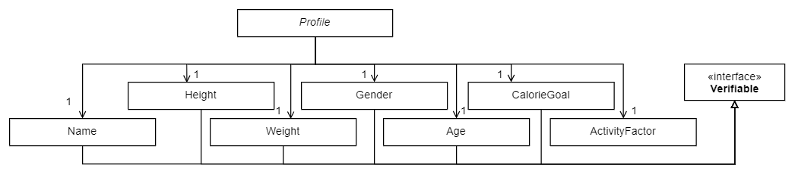
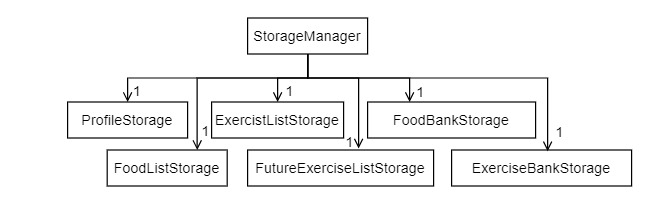
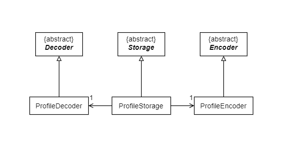

# Developer Guide

## Acknowledgements

{list here sources of all reused/adapted ideas, code, documentation, and third-party libraries -- include links to the original source as well}

## Design & implementation

### Profile

A Profile class has various attributes such as Name, Height, Weight, Gender, Age, Calorie Goal and Activity Factor

### Storage component

The `StorageManager` component loads and saves:
- your profile - including name, height, weight, gender, age, calorie goal and activity factor 
- list of exercises done - including date performed
- list of food consumed - including date and time of consumption
- scheduled exercises - recurring exercises that are scheduled in the future
- food and exercise banks - names and calories of relevant item

Each storage is able to decode/encode details from the bot and is designed this way (Using ProfileStorage as an example)

where:
- ProfileEncoder encodes the list to the profile.txt file.
- ProfileDecoder decodes the list from profile.txt file and inputs into the bot.
- ProfileStorage initializes the encoder and decoder and utilizes them for reading or writing operations.

###Logic Component
The `Logic` component is responsible for making sense of user input.

Below is a high level class diagram of the `Logic` component, which shows how it interacts with other components 
like `Main` and `Data`.

 

Here is a more detailed class diagram of the `Logic` component.

Taking a closer look into the parsing process, the `ParserManager` actually does not do most of the parsing itself.
(To be completed)

The sequence diagram below models the interactions between the different classes within the `Logic` component and 
illustrates how a user input `add f/potato c/20` is parsed and process to execute the appropriate actions.

## Product scope
### Target user profile

{Describe the target user profile}

### Value proposition

{Describe the value proposition: what problem does it solve?}

## User Stories

|Version| As a ... | I want to ... | So that I can ...|
|--------|----------|---------------|------------------|
|v1.0|new user|see usage instructions|refer to them when I forget how to use the application|
|v2.0|user|find a to-do item by name|locate a to-do without having to go through the entire list|

## Non-Functional Requirements

{Give non-functional requirements}

## Glossary

* *glossary item* - Definition

## Instructions for manual testing

{Give instructions on how to do a manual product testing e.g., how to load sample data to be used for testing}
