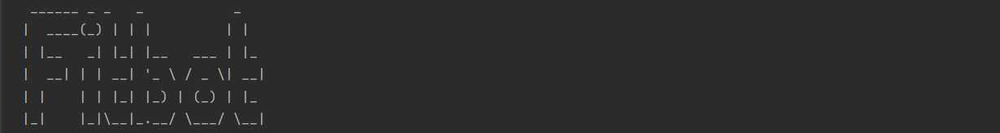

_Fitbot_ is a **desktop app** that helps university students who are looking to
**keep track of their calorie consumption and calorie output** with the speed and convenience of
**command-line based** tools, especially in times of online school.

_Fitbot_ can be used across all operating systems such as Windows, Mac OS X, Linux and Unix. It is optimised for use via 
a [Command-Line Interface (CLI)](https://en.wikipedia.org/wiki/Command-line_interface), so it would be especially beneficial for fast
typers and people who enjoy a clean and simple app interface.

If you type fast, and you need an easy and quick way to record your calories, _Fitbot_ is the app for you! 💪💯

**Useful links**:
* If you are interested to know how to use _Fitbot_ : [User Guide](UserGuide.md)
* If you are interested to know how we built _Fitbot_ : [Developer Guide](DeveloperGuide.md)
* If you are interested to know more about the team behing _Fitbot_: [About Us](AboutUs.md)

